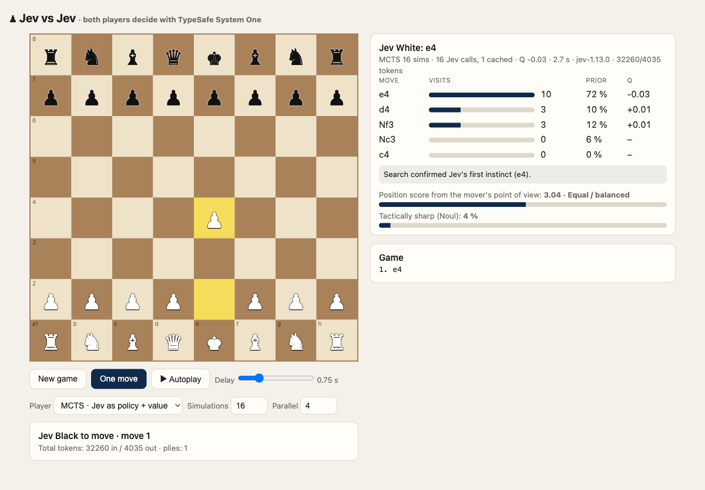

# Jev vs Jev – Chess where every move is a TypeSafe decision

Two virtual chess players, both powered by **[TypeSafe](https://typesafe.ai)**'s System One model **Jev**.
No engine, no generated text: each move is a typed decision that the model returns with a full
probability distribution, and the code does the rest. Optionally, a Monte Carlo Tree Search uses
those same distributions as policy and value, AlphaZero-style, to play noticeably better.



## Why this exists

Most "AI plays a game" demos prompt a chat model, parse whatever text comes back and
hope it is a legal move. TypeSafe turns that around. You keep the rules, the state and
the workflow in ordinary code, and ask the model a **narrow, typed question** whenever
your code needs judgment instead of computation.

That is what makes System One models feel like a new programming primitive:

| What you send | What you get back |
| --- | --- |
| The current game state as JSON | Nothing you have to parse |
| A **Choice** question with one option per legal move | The chosen move plus a probability for *every* option and a confidence value |
| A **Score** question with ordered levels | A calibrated position evaluation, useful for a UI or a threshold |
| A **Noul** (yes/no) question | The probability that the position is tactically sharp |

All three questions ride along in **one request** and are answered in parallel.
In fast mode a move takes about 350 ms end to end.

## How it works

```
chess.js (rules) ──► legal moves ──► one Choice option per move ──► Jev ──► move + probabilities
                      state (board, material, history, style) ─────┘         score + noul
```

1. **Code owns the rules.** [`chess.js`](https://github.com/jhlywa/chess.js) generates the legal
   moves. The model can only ever pick one of them, so an illegal move is impossible by construction.
2. **Code computes the facts.** For each candidate move the server works out what a rules engine
   knows for sure: the piece, captures, checks, castling, promotion, and whether the moved piece can be
   captured on arrival and whether that square is defended. Those facts become the option's
   description.
3. **Jev supplies the judgment.** The model sees the board, the material balance, the recent moves,
   the player's style and the annotated options, and returns a probability distribution over the moves.
4. **Code acts.** The server plays the top choice, records the distribution, score and sharpness for the
   UI, and hands the turn to the other Jev.

White is told to play actively, Black to play solidly. Same model, two personalities, both expressed
as plain text in the state.

### MCTS: Jev as policy and value network

The same Jev call that picks a move in fast mode is exactly what an AlphaZero-style search needs
from a neural network: a **policy** (prior probability for every legal move, from the Choice
answer) and a **value** (how good the position is for the side to move, from the Score answer,
mapped to −1…+1). [`mcts.js`](mcts.js) wires that into a PUCT tree search:

- Every new tree node costs one Jev call. There are no random rollouts. The budget is counted
  in API calls; transpositions are cached for the whole game.
- Selection follows PUCT: `Q + c · P · √N_parent / (1 + N_child)`, so Jev's prior steers the
  search towards its favourite moves while values from deeper positions can overrule it.
- Leaves are evaluated concurrently (virtual loss), so 16 evaluations take a few seconds.
- The final move is ranked by Q among candidates with comparable coverage, because with a
  small budget visit counts mostly mirror the prior.
- The UI shows visits, prior and Q for the top candidates and says whether the search
  **confirmed or overruled** Jev's first instinct.

**What the first benchmark taught us.** The initial version lost to the single-call player.
Dissecting a lost position with `scripts/mcts-inspect.mjs` showed why: Jev's Score is an absolute
judgment, and once one side is materially ahead it says "clearly better" for *every* child
position, so the tree had nothing to rank on and its choices were noise. The tree mechanics were
fine (verified with an injected perfect-information evaluator in `scripts/mcts-selftest.mjs` and
against an alpha-beta oracle in `scripts/mcts-oracle.mjs`, plus an independent code review).

The fix follows the TypeSafe rule of thumb, *keep what code can compute in code*
([`tactics.js`](tactics.js)):

- **Exact facts in the option descriptions.** Each candidate move now carries an exchange
  estimate from a capture-only lookahead ("wins about 3 after forced recaptures") and a flag if it
  allows a mate in one. This sharpens Jev's policy in both modes.
- **Hybrid leaf value.** In the search, Jev's value is blended with the change in settled material
  relative to the root and with mate-in-one detection. Jev keeps the positional judgment, code
  supplies the tactical delta that a coarse rubric cannot express.
- **Exact tactics at the root.** An immediate mate is always played; moves that allow a mate in
  one are excluded when an alternative exists.

**Does it help now?** Re-running the same 2-game benchmark (`npm run match -- 16 6 2`, 16 evaluations
per move, colours swapped, both players using the new tactical facts) the search won both games,
one as White and one as Black, at about 47k tokens and 3 seconds per move versus 2.6k tokens and
0.4 seconds for the single-call player. The search overruled Jev's first instinct in roughly half
the moves. Two games are still a small sample; treat this as a promising signal, not a proof, and
run `npm run match` yourself.

## Run it

Requires Node.js 20+ and a TypeSafe API key ([get one at typesafe.ai](https://typesafe.ai)).

```sh
git clone https://github.com/TholeG/typesafe-chess.git
cd typesafe-chess
npm install
export TYPESAFE_API_KEY=your_key_here     # or put it in .env and source it
npm start                                 # builds the React client, then serves it
# open http://localhost:3000
```

For UI development run the API and the Vite dev server side by side:

```sh
npm run build && node server.js           # API + built client on :3000
npm run dev                               # hot-reloading client on :5173, proxies /api
```

To benchmark MCTS against the single-call player:

```sh
npm run match -- 16 6 2                   # simulations, parallel evaluations, games
```

Click **One move** for a single move or **▶ Autoplay** to let the two Jevs play a full game.
Switch between **MCTS** and **Fast** in the players card and set the number of simulations and
parallel evaluations. The board draws arrows for the top candidates (the played move in blue),
the bar next to it shows the position score from White's view, and the analysis card lists the
candidates (probabilities in fast mode, visits / prior / Q in MCTS mode), the sharpness estimate,
latency and token usage per move. Click any move in the list to review that position and its
analysis.

Cost guide: a fast move uses roughly 2–3k tokens. An MCTS move with 16 evaluations uses roughly
40–50k tokens and 3 seconds. Defaults can be set with `MODE`, `MCTS_SIMULATIONS` and
`MCTS_CONCURRENCY` environment variables.

The API key stays on the server. The browser only talks to three local endpoints:
`GET /api/state`, `POST /api/new`, `POST /api/step`, `POST /api/settings`.

## What to look at

- **Confidence is not strength.** In quiet openings the confidence is often below 0.2 because
  several moves are genuinely fine. That is calibration, not indecision. Once a capture or a mate
  is on the board the distribution collapses onto one move.
- **Probabilities are reusable data.** The UI ranks candidates from the same response that
  produced the move. No second call needed for "what else was considered".
- **Speculative questions are cheap.** Score and Noul add a few hundred tokens and no latency,
  because all questions are evaluated in parallel over the same state.
- **Facts beat prose.** The single biggest quality lever is what the code puts into each
  option description. Better facts (say, the material balance after a short exchange) would
  make Jev a better player without changing a single prompt sentence.

Jev is not a chess engine and does not calculate variations. It judges the options it is given.
Expect creative openings, sound development, and the occasional blunder. Expect it to be fun to watch.

## Files

| File | Purpose |
| --- | --- |
| `jev-player.js` | Builds the state and questions, calls the TypeSafe SDK, returns policy and value |
| `mcts.js` | PUCT tree search using Jev's policy and hybrid value, with concurrency and a transposition cache |
| `tactics.js` | Exact code-side helpers: material, capture-only lookahead, mate in one |
| `server.js` | Express server, game state, settings and the JSON endpoints; serves the built client |
| `client/` | React UI (Vite + [react-chessboard](https://github.com/Clariity/react-chessboard)): board, arrows, eval bar, analysis, move review |
| `scripts/match.mjs` | Benchmark: MCTS vs fast player with alternating colours |
| `scripts/mcts-selftest.mjs`, `mcts-oracle.mjs`, `mcts-inspect.mjs` | Mechanics tests without API calls, and a tree dump for any position |

## Learn more about TypeSafe

- [Documentation](https://docs.typesafe.ai) and the [quick start](https://docs.typesafe.ai/introduction/quickstart)
- [How to build with System One](https://docs.typesafe.ai/concepts/how-to-build-with-system-one)
- The three primitives: [Choice](https://docs.typesafe.ai/primitives/choice),
  [Score](https://docs.typesafe.ai/primitives/score), [Noul](https://docs.typesafe.ai/primitives/noul)
- [Confidence](https://docs.typesafe.ai/confidence) and the
  [speculative fan-out pattern](https://docs.typesafe.ai/patterns/fan-out) used here
- SDKs for [JavaScript](https://docs.typesafe.ai/sdk/javascript) and [Python](https://docs.typesafe.ai/sdk/python)
- Coding agent? Install the [TypeSafe skill](https://github.com/typesafe-ai/skills) and it will
  read the live docs before writing an integration. This repo was built that way.

MIT licensed. Built in a day with Claude Code and the TypeSafe agent skill.
